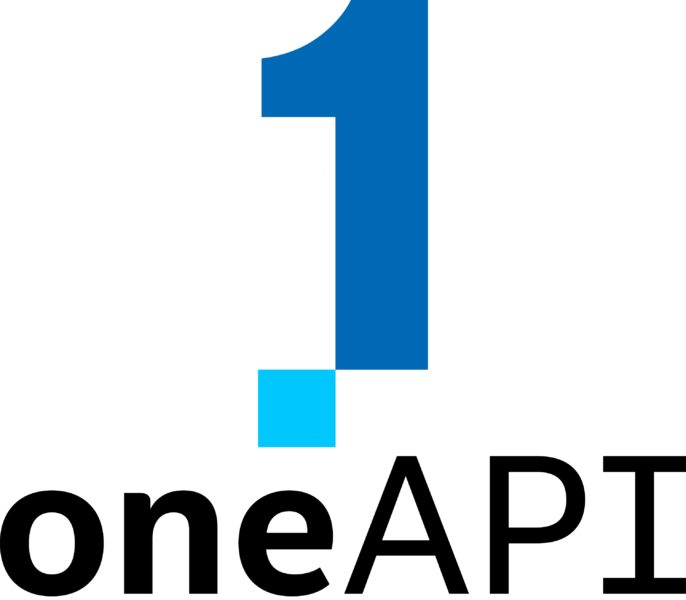

This course is a live workout session provided in the context of the [EUMaster4HPC](https://eumaster4hpc.uni.lu/) project, participants will explore how to program High-Performance FPGA cards using the Intel DPC++ compiler, a [SYCL implementation](https://www.khronos.org/sycl/), to facilitate heterogeneous device programming. 

Field-Programmable Gate Arrays (FPGAs) are integrated circuits that can be configured by users post-manufacturing. They consist of a network of programmable logic blocks and reconfigurable interconnects, enabling the creation of custom digital circuits. Traditionally, FPGAs have been programmed using Hardware Description Languages (HDLs) such as Verilog and VHDL. However, designing high-performance accelerators with these languages demands extensive knowledge and experience in hardware design. 

By leveraging higher-level abstractions like SYCL and OpenCL—C/C++-based programming models familiar to software developers—developers can generate hardware kernels through an offline compiler. This significantly simplifies FPGA programming, reducing development time compared to HDL, which typically involves more complex coding, simulation, and debugging processes. 

Following an introduction to Meluxina’s FPGA cards and an overview of SYCL programming using the [OneAPI software development toolkit](https://www.intel.com/content/www/us/en/developer/tools/oneapi/overview.html), an hands-on session will be proposed to students.  

**<u>Start</u>**: 06/06/2024 - 9:00 am 

**<u>End</u>**: 06/06/2024 - 17:00 pm 

**<u>Location</u>**: Online 

### Why using FPGAs as Hardware Accelerators (HA)?

- **Customizability and Reconfigurability**: Unlike CPUs and GPUs, which have fixed architectures, FPGAs can be programmed to create custom hardware configurations. This allows for the optimization of specific algorithms or processes, which can be particularly beneficial for quantum simulations, where different algorithms might benefit from different hardware optimizations.

- **Parallel Processing**: FPGAs can be designed to handle parallel computations natively using pipeline parallelism.

- **Low Latency and High Throughput**: FPGAs can provide lower latency than CPUs and GPUs because they can be programmed to execute tasks without the overhead of an operating system or other software layers. This makes them ideal for real-time processing and simulations.

- **Energy Efficiency**: FPGAs can be more energy-efficient than GPUs and CPUs for certain tasks because they can be stripped down to only the necessary components required for a specific computation, reducing power consumption.

## [Intel® FPGA SDK & oneAPI for FPGA](https://www.intel.com/content/www/us/en/developer/tools/oneapi/toolkits.html#gs.3c0top) 

- The [Intel® FPGA Software Development Kit (SDK)](https://www.intel.com/content/www/us/en/docs/programmable/683846/22-4/overview.html) provides a comprehensive set of development tools and libraries specifically designed to facilitate the design, creation, testing, and deployment of applications on Intel's FPGA hardware. The SDK includes tools for both high-level and low-level programming, including support for hardware description languages like VHDL and Verilog, as well as higher-level abstractions using OpenCL or HLS (High-Level Synthesis). This makes it easier for developers to leverage the power of FPGAs without needing deep expertise in hardware design.

{ align=right width=200 }

- [Intel® oneAPI](https://www.intel.com/content/www/us/en/developer/tools/oneapi/toolkits.html#gs.3c0top) is a unified programming model designed to simplify development across diverse computing architectures—CPUs, GPUs, FPGAs, and other accelerators. The oneAPI for FPGA component specifically targets the optimization and utilization of Intel FPGAs. It allows developers to use a single, consistent programming model to target various hardware platforms, facilitating easier code reuse and system integration. oneAPI includes specialized libraries and tools that enable developers to maximize the performance of their applications on Intel FPGAs while maintaining a high level of productivity and portability.

In this course, you will learn to:

- How to use Meluxina's FPGA, i.e., Intel® FPGA

- How to use fundamentals for SYCL programming

!!! danger "Remark"
    This course is not intended to be exhaustive. In addition, the described tools and features are constantly evolving. We try our best to keep it up to date. 

## Who is the course for ?

- This course is for students, researchers, enginners wishing to discover how to use oneAPI to program FPGA. 

- Participants should still have some experience with modern C++ (e.g., [Lambdas](https://en.cppreference.com/w/cpp/language/lambda), [class deduction templates](https://en.cppreference.com/w/cpp/language/class_template_argument_deduction)).

## Resources

- [Data Parallel C++: Programming Accelerated Systems Using C++ and SYCL (second edition)](https://link.springer.com/book/10.1007/978-1-4842-9691-2)
- [Intel oneAPI DPC++/C++ Compiler Handbook for Intel FPGAs](https://www.intel.com/content/www/us/en/docs/oneapi-fpga-add-on/developer-guide/2024-1/intel-oneapi-dpc-c-compiler-handbook-for-intel.html)

## About this course

{ align=right width="250" }

This course has been developed by the **Supercomputing Application Services** group at LuxProvide in the context of the EUMaster4HPC project.

